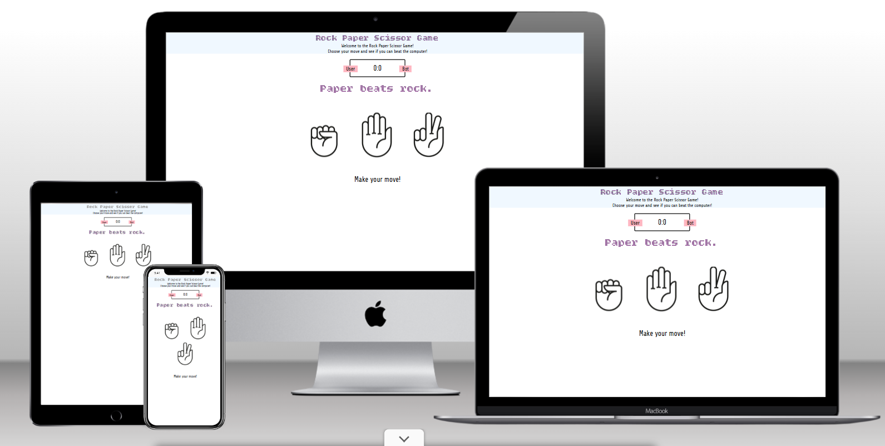
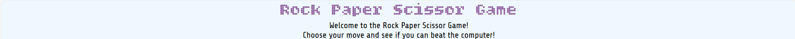
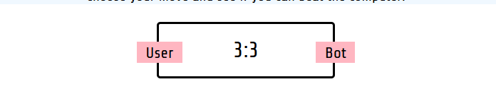
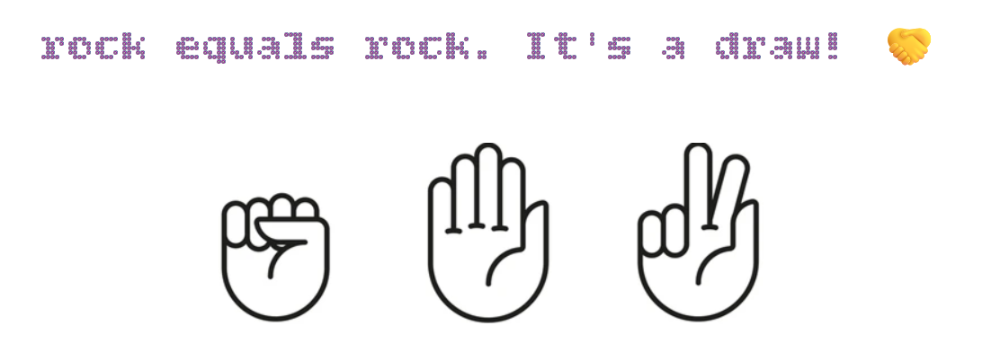

# javascript-game

This site will be working as the rock paper scissor game, where user will be up against bot in rock paper scissor contest.

[Link to deployed site](https://timothyyw.github.io/javascript-game/)

# Feature

## Logo

The logo or Favicon show casing the three options for the rock paper scissor game.

## Index

Within index there is a welcoming message for the user to the rock paper scissor game.

## Score

This is scoring system to count the points scored by player and computer.

## Game

The game feature three hand sign starting from rock paper and scissor, which player can choose. While the computer will be choosing randomly to compete with player to see who would win.

Right below showing the message encouraging player to make their move.

## Technologies utilized

HTML is used for write the code and to built the website.

CSS is used style the code.

JavaScript is to create functions for the game.

Google Fonts is providing the style for the letter that is written and displayed on the website.

Github is where the code will be stored.

Google Chrome Lighthouse is used to check the website performance and accessibility.

Balsemig is used to make the sketch wireframes for the website strucutres.

W3C used to validated and ensured there are no errors on HTML code.

Jigsaw is to ensure that there are no error on the CSS code.

Wave is to check if there is color contrast.

# Deployment

To deploy the project please follow step below:
    
    1. Log in to Github.
    2. Go to setting right next to Insight.
    3. Within setting navigate to Pages below Codespaces.
    4. Under the Branch, change from "none" to "main".
    5. Click "Save".
    6. Wait for few minute.
    7. A link will be provided.

## Version Control

To use version control utilizing the git command:

    1. Git add . will create a file with the new code that has been added
    2. Git commit is to commit the changes
    3. Git push is to add the version of the file in to the repository

After creating new version of the file it will be commited, which means it can be viewed and compared previous and newer version.

## Cloning Repository 

For cloning repository, can be done as followed:

    1. Open github repository
    2. Above file open drop down menu code copy URL, there are three version HTTP, SSH, and GitCLI, all version work on cloning.
    3. Open Git Bash.
    4. Type Git clone URL

# Credits

tutorial to create the game

https://www.youtube.com/watch?v=jaVNP3nIAv0 

favicon

https://www.flaticon.com/free-icon/rock-paper-scissors_6851302